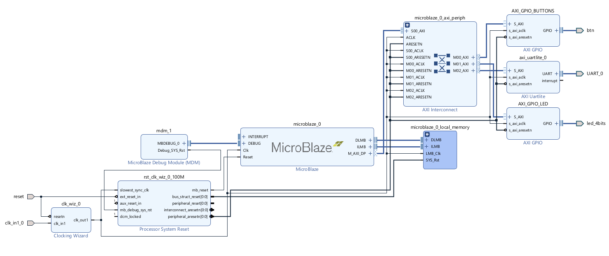

# Project: Getting started with Vivado and Vitis
This project is created following the tutorial found at the following website


- https://digilent.com/reference/programmable-logic/guides/getting-started-with-ipi


## Hardware used 

- [Arty A7 - 35T](https://digilent.com/reference/programmable-logic/arty-a7/start) developement board


Software used:
- Vivado for the hardware management
- Vitis for the developement of the software


# Tutorial
Let's see step by step what to do with Vivado software

## Vivado 

1. First, we need to create a project. Open Vivado and click on "create new project", then select the costraint file which can be found on the Digilent Github repository, select the target board. To select the target board you need to install into Vivado the board files:
- Costraint files: https://github.com/Digilent/digilent-xdc
- Board files: https://github.com/Digilent/vivado-boards

2. Click on "Create block design" in the "Project manager" tab. Then, give a name to the block design and click on "ok".

3. Now we have an empty block design. We need to insert into our design a Microblaze soft-core processor. To do this, let's start by inserting the Clocking Wiziard. Click on the "IP catalogue", or on the "+" symbol on the toolbar in the design window. Search for "Clocking Wiziard" and add this IP to the design.

4. Double click on the Clocking Wiziard to set-up the parameters of the clocking wiziard. Be sure that the output clock in the "Output Clocks" tab is setted to be 100 MHz. Uncheck the "locked" option, set the "Active high reset". Right-Click on "reset" and click on "make external" to create an external pin. Same for "clk_in". NOTE: The system reset from the board is "Active high". 

5. To insert a NOT port for the negation of the reset signal, click on "IP integrator" or the "+" and add "Utility vector logic". Double click on it and set "NOT PORT". Resize to 1 bit the input and output width. 

6. Now we need to add to the design the Microblaze processor. Open the IP catalogue and search for "Microblaze". Add it to the design. Click on "Run Block Automation" and set the memory to "128 KB", the allowed maximum value. The basic Microblaze block design is reported below.  


7. Now we are going to add the GPIO peripherals to the design. Open the Board panel, right click the output 4LEDs and click on "Connect board component". Select the "GPIO" IP on the pop-up panel. Rename the IP to "AXI_GPIO_LED". Now add manually a second GPIO component and name it "AXI_GPIO_BUTTONS". Click on the GPIO pin and "Make external" in order to have an output pin. Rename this external pin to "btn". The output pin has to be connected to the phisical pins on the board. To do this, the XDC file is used. The costraint file has the task to connect the input-output pins from the top-module to the physical devices on the board. Since the default GPIO width is 32 we need to change it to 4. The XDC setup will follow in the last part of this tutorial. Now we can click on "Run connection automation". As it is possible to see, an AXI peripheral interconnect component will appear into our design. This element is essential. 

8. Add the AXI Uartlite component to the design. Make external the UART pin at output/input. Run the "connection automation". The final block design is reported in the following picture.



9. Now, it is extremely important to look at the Address map for our Microblaze processor. In the design panel click on "Address map".
 It is essential to verify that 128K is setup in the RANGE for the Microblaze memory. This value has been set up by the "Run block automation".

10. Save the block design. 

11. Validate the design.

12. Create the HDL wrapper. Go to the source panel, right clock on the block design and click on "Generate HDL wrapper". Tick the option "Let Vivado manage...". 

12. Now we need to add the constraints. Be sure to correctly safe the block design. The HDL wrapper should be updated automatically. Now open the instantiation template "design_1_wrapper.v"

This should be the instantiation template automatically generated by Vivado. We need to take these peripheral names and insert these into the XDC constraint file. 
```
## Clock signal
set_property -dict { PACKAGE_PIN E3    IOSTANDARD LVCMOS33 } [get_ports { clk_in1_0 }]; #IO_L12P_T1_MRCC_35 Sch=gclk[100]

create_clock -add -name sys_clk_pin -period 10.00 -waveform {0 5} [get_ports { clk_in1_0 }];

## LEDs
set_property -dict { PACKAGE_PIN H5    IOSTANDARD LVCMOS33 } [get_ports { led_4bits_tri_out[0] }]; #IO_L24N_T3_35 Sch=led[4]

set_property -dict { PACKAGE_PIN J5    IOSTANDARD LVCMOS33 } [get_ports { led_4bits_tri_out[1] }]; #IO_25_35 Sch=led[5]

set_property -dict { PACKAGE_PIN T9    IOSTANDARD LVCMOS33 } [get_ports { led_4bits_tri_out[2] }]; #IO_L24P_T3_A01_D17_14 Sch=led[6]

set_property -dict { PACKAGE_PIN T10   IOSTANDARD LVCMOS33 } [get_ports { led_4bits_tri_out[3] }]; #IO_L24N_T3_A00_D16_14 Sch=led[7]

## Buttons
set_property -dict { PACKAGE_PIN D9    IOSTANDARD LVCMOS33 } [get_ports { btn_tri_io[0] }]; #IO_L6N_T0_VREF_16 Sch=btn[0]

set_property -dict { PACKAGE_PIN C9    IOSTANDARD LVCMOS33 } [get_ports { btn_tri_io[1] }]; #IO_L11P_T1_SRCC_16 Sch=btn[1]

set_property -dict { PACKAGE_PIN B9    IOSTANDARD LVCMOS33 } [get_ports { btn_tri_io[2] }]; #IO_L11N_T1_SRCC_16 Sch=btn[2]

set_property -dict { PACKAGE_PIN B8    IOSTANDARD LVCMOS33 } [get_ports { btn_tri_io[3] }]; #IO_L12P_T1_MRCC_16 Sch=btn[3]

## USB-UART Interface
set_property -dict { PACKAGE_PIN D10   IOSTANDARD LVCMOS33 } [get_ports { UART_0_txd }]; #IO_L19N_T3_VREF_16 Sch=uart_rxd_out

set_property -dict { PACKAGE_PIN A9    IOSTANDARD LVCMOS33 } [get_ports { UART_0_rxd }]; #IO_L14N_T2_SRCC_16 Sch=uart_txd_in

## RESET
set_property -dict { PACKAGE_PIN C2    IOSTANDARD LVCMOS33 } [get_ports { reset_0 }]; #IO_L16P_T2_35 Sch=ck_rst
```
If you use the template from Digilent repository be careful! There is an error in the UART costraints (there is a little confusion of the nomenclature adopted). 

13. Save all the files and click on "Generate bitstream". Vivado will go through the Synthesis, implementation and bitstream generation. The process will take a lot of time.

14. Once the bitstream generation is completed we need to export the hardare. Go to File > Export > Export Hardware. Be sure to select the option "Include bitstream". Save the XSA file in the default directory selected by Vivado. 

## Vitis 

15. Lunch Vitis. Create a new workspace folder to keep the files organised. Create an "Application project". 

16. Click on the tab "Create a new platform from hardware XSA". Browse to the xsa file generated by Vivado. Click Next. Give a name to the application project. The name I gave to the project is "Getting_started_VIVADO_VITIS". The processor is "microblaze_0". Clickl Next. Choose the "standalone" option in the "Operating system" menu. Click Next. Select "Empty C application". 
In the picture you can see the application project in Vitis and the hardware platform containing the Board Support Package (BSP) which contains the drivers coming from the IP Vivado libraries. 

17. Go to the explorer panel, go to the software project, right click on "src" and "add new file". The file should be named "main.c" containing the software that will be uploaded to the microprocessor. Below it has been reported the code.
```
#include "xparameters.h"
#include "xil_printf.h"
#include "xgpio.h"
#include "xil_types.h"
 
// Get device IDs from xparameters.h
#define BTN_ID XPAR_AXI_GPIO_BUTTONS_DEVICE_ID
#define LED_ID XPAR_AXI_GPIO_LED_DEVICE_ID
#define BTN_CHANNEL 1
#define LED_CHANNEL 1
#define BTN_MASK 0b1111
#define LED_MASK 0b1111
 
int main() {
	XGpio_Config *cfg_ptr;
	XGpio led_device, btn_device;
	u32 data;
 
	xil_printf("Entered function main\r\n");
 
	// Initialize LED Device
	cfg_ptr = XGpio_LookupConfig(LED_ID);
	XGpio_CfgInitialize(&led_device, cfg_ptr, cfg_ptr->BaseAddress);
 
	// Initialize Button Device
	cfg_ptr = XGpio_LookupConfig(BTN_ID);
	XGpio_CfgInitialize(&btn_device, cfg_ptr, cfg_ptr->BaseAddress);
 
	// Set Button Tristate
	XGpio_SetDataDirection(&btn_device, BTN_CHANNEL, BTN_MASK);
 
	// Set Led Tristate
	XGpio_SetDataDirection(&led_device, LED_CHANNEL, 0);
 
	while (1) {
		data = XGpio_DiscreteRead(&btn_device, BTN_CHANNEL);
		data &= BTN_MASK;
		if (data != 0) {
			data = LED_MASK;
		} else {
			data = 0;
		}
		XGpio_DiscreteWrite(&led_device, LED_CHANNEL, data);
	}
}
```
18. Click on "Build project".
19. Now we need to connect the FPGA to the computer via the USB cable.  


